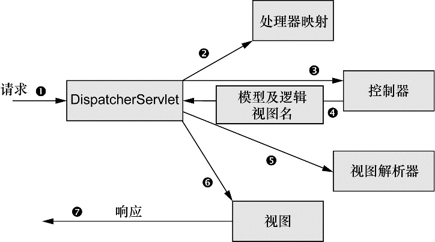

Spring框架是以**简化**Java EE应用程序的开发为目标而创建的，Spring提供了更加轻量级和简单的编程模型，解决企业级应用程序开发的复杂性，Spring的目标是致力于全方位的简化Java开发。

**Spring框架的核心：Spring容器 + 依赖注入（DI，dependency injection）+ AOP（面向切面编程,aspect-oriented programming）。**

Spring Boot将Spring应用中样板式的配置移除掉，让读者更加抓住于业务功能。

封面插图：1796年法国旅游图书中的约旦居民，在当时，为了娱乐而去旅行还是相对新鲜的做法，体现了各个地区生活的多样性。

<center><font size="6" face="黑体" color="red"> 第一部分  Spring的核心</font></center>

### 第一章 spring之旅

#### 1.1 Spring简化开发

###### 1.1.1 Spring简化开发的第一个理念——依赖注入

&nbsp;&nbsp;&nbsp;&nbsp;&nbsp;&nbsp;任何一个有实际意义的应用都会有两个或者更多的类相互协作和耦合完成特定的业务逻辑。耦合具有两面性：一方面紧密耦合的代码难以测试、难以复用、难以理解；另一方面，一定程度的耦合又是必须的——完全没有耦合的代码什么也做不了。总之，耦合是必须的，但应当被小心谨慎的处理。**DI所带来的最大收益—松耦合。对象的依赖关系通过系统中负责协调各对象的第三方组件在创建对象的时候进行设定，而无需自行管理。**

创建应用组件之间协作的行为通常称为装配(wiring)。常见的装配方式有XML配置、基于JavaConfig的配置、自动化装配。见第二章。

bean组件、POJO（简单老式Java对象,plain Old Java Object）

Spring通过应用上下文（Application Context）装配bean的定义并把他们组装起来。

已知有两个类`BraveKnight`和`SlayDragonQuest`，表示勇敢的骑士接受杀龙的探险任务。以下代码展现了Spring配置文件是如何将`SlayDragonQuest`注入到`BraveKnight`中的。在这里`BraveKnight`和`SlayDragonQuest`被声明为Spring中的bean，就`BraveKnight` bean来讲，它在构造时传入了`SlayDragonQuest`的引用，这是依赖注入的实现方式之一——构造器注入。Spring基于XML创建应用上下文，装载bean的定义并把它们组装起来。


<center>程序清单：使用Spring将`SlayDragonQuest`注入到`BraveKnight`中</center>


<center>程序清单：Knight Java加载包含Knight的Spring上下文</center>

###### 1.1.2  Spring简化开发的第二个理念——基于切面进行声明式编程

&nbsp;&nbsp;&nbsp;&nbsp;&nbsp;&nbsp;DI能够让保持相互协作的软件组件保持松散耦合，AOP允许你把遍布应用各处的功能分离出来形成可重用的组件。我们可以把切面想象成覆盖在很多组件之上的一个外壳，**借助AOP，可以使用各种系统功能层包裹核心业务层，将安全、事务和日志关注点与核心业务逻辑相分离。**


<center>图1 关注点（例如日志、安全）的调用经常散布在各个模块中，而这些关注点并不是模块的核心业务</center>

JDBC（Java DataBase Connectivity,java数据库连接）是一种用于执行SQL语句的Java API.

已知有第三个类吟游诗人，用来记载骑士的事迹并将其进行传唱。`Minstrel`他是一个服务类，如果将其按照下面的方式让`BraveKnight`直接调用会觉得不对劲——管理吟游诗人真的是骑士分内的事情吗？？

```java
public class BraveKnight implements Knight{
    private Quest quest;
    private Minstrel minstrel;
    public BraveKnight(Quest quest,Minstrel minstrel){
        this.quest = quest;
        this.minstrel = minstrel;
    }
	public void embarkOnQuest() throws QuestException{
        minstrel.singBeforeQuest();     //Knight应该管理它的Minstrel吗？？
        quest.embark();
        minstrel.singAfterQuest();
    }    
}
```

Spring的解决方法是把`Minstrel`声明为一个切面，然后把`Minstrel`应用到`BraveKnight`中。程序清单如下：


###### 1.1.3  Spring简化开发的第三个理念 

Spring简化开发的第三个理念——Spring旨在通过模板封装消除样版式代码。

###### 1.1.4  Spring简化开发的第四个理念 

Spring简化开发的第四个理念——非侵入式编程，保持POJO，不强迫原有类继承新框架提供的类或者实现它们的接口从而导致应用与框架绑死的问题。

实现思想：Spring上下文编程 + XML配置 + bean（依赖注入 + AOP）

#### 1.2 Spring容器

容器是Spring框架的核心。应用对象（bean组件）生存于Spring容器（container）中，容器负责管理组件bean的创建、配置和组装，管理它们整个生命周期，从出生到死亡（new到finalize）。Spring容器通过使用DI管理构成应用的组件，它会创建相互协作的组件之间的关联。

Spring容器有两种实现方式：bean工厂和应用上下文。bean工厂是最简单的容器，但是对于大多数应用来说太低级了，因此，应用上下文比bean工厂更受欢迎。

#### 1.3 Spring体系结构

Spring框架之外还存在一个构建在核心框架之上的庞大生态圈，它将Spring扩展到不同的领域：web服务、REST、移动开发以及NoSQL。


- Spring核心容器。
- Spring的AOP模块。
- 数据访问与集成。
- Web与远程调用。Spring MVC(Model-View-Controller).
- Instrumentation。
- 测试。

Spring Potfolio包括多个构建于核心Spring框架之上的框架和类库。概括地讲，整个Spring Portfolio几乎为每一个领域的Java开发都提供了Spring编程模型。

Spring Data.尽管关系型数据库统治企业级应用多年，但是随着数据量的增加，现代化的应用正在认识到不是所有的数据都适合放在一张表的行和列中，非关系型数据库NoSQL更为合适。

Spring Boot是一个崭新的令人兴奋的项目，他以Spring的视角，致力于简化Spring本身。

### 第二章 装配bean

&nbsp;&nbsp;&nbsp;&nbsp;&nbsp;&nbsp;创建应用对象之间协作关系的行为成为装配（`wiring`），这就是依赖注入（`DI`）的本质。在本章我们将介绍Spring完成装配bean的基础知识。简单可以理解为**创建bean、装配bean**两个步骤，前者是创建bean加入Spring容器，后者是为bean添加之间的依赖关系。

**装配bean是依赖注入的本质，完成应用对象之间协作关系的创建，或者说一个对象和另一个对象进行关联。 **

Spring提供了三种装配机制：1. XML显示配置 2.JavaConfig中显示配置 3.隐式的bean发现机制和自动装配.

笔者建议尽可能地使用自动配置的机制，显示配置越少越好。当必须显示配置bean的时候（比如使用第三方库中的类），推荐使用类型安全并且比`XML`更加强大的`JavaConfig`。最后，只有当想要使用便利的`XML`命名空间，并且在`JavaConfig`中没有同样的实现时，才应该使用`XML`.

###### 2.1 自动化装配bean

包括两个过程：组件扫描（自动发现应用上下文中所创建的bean）、自动装配（自动满足bean之间的依赖）.

注解`@ComponentScan`会自动扫描包内所有带有`@Component`注解的类，并为其创建bean。

注解`@Autowired`声明构造器或者`Setter`方法会自动装配来自外部的`bean`,自动满足bean之间的依赖。

```java
//Java类(带@Component)
package soundsystem;
import org.springframwork.steretype.Component;

@Component
public class SgtPepper implements CompactDisc{
    private String title = "Sgt. Pepper's Lonely Hearts Club";
    private String artist = "The Beatles";
    
    public void play(){
        System.out.println("Playing" + title + "by" + artist);
    }
} 

//Java类(带@Component、@wired)
package soundsystem;
import org.springframwork.steretype.Component;
import org.springframwork.beans.factory.annocation.Autowired;

@Component
public class CDPlayer implemenets MediaPlayer{
    private CompactDisk cd;
    
    @Autowired //自动装配CompactDisk，构造器
    public CDPlayer(CompactDisk cd){//构造函数表明依赖关系
        this.cd = cd;
    }
    
    @Autowired //自动装配CompactDisk，属性Setter方法
    public void SetCompactDisc(CompactDisc cd){//属性的Setter方法表明依赖关系
        this.cd = cd;
    }
    public void play(){
        cd.play();
    }
}

//配置文件
package soundsystem;
import org.springframwork.context.annocation.Configuration;
import org.springframwork.context.annocation.ComponentScan;

@Configurarion
@ComponentScan //自动扫描 soundsystem 下所有带有@component注解的类
public class CDPlayerConfig{
   // null 不做任何配置
}
```


###### 2.2 通过JavaConfig装配bean

当有第三方库中的组件装配到你的应用中时，无法在其类上添加`@Component`和`@Autowired`注解的，这时候必须采用`JavaConfig`和`XML`显示配置。

注解`@Configuration`表明这个类是一个`JavaConfig`的配置类；

注解`@Bean`告诉Spring这个方法将会返回一个对象，该对象会被注册为Spring应用上下文中的`bean`;通过参数传入实现自动装配另一个bean到配置方法中，如以下案例。

```java
package soundsystem;
import org.springframwork.context.annocation.Configuration;

@Configuration //以下类是一个JavaConfig配置类
public class CDPlayerConfig{
    @Bean
    public CompactDisc sgtPeppers(){//创建bean
        return new SgePeppers();
    }
    @Bean
	public CDPlayer cdPlayer(CompactDisc compactDisc){//参数传入，实现装配bean
    	return new CDPlayer(compactDisc);
	}
}
```

###### 2.3 通过XML装配bean

创建bean采用`<bean>`原色，装配bean时从注入的方式分为构造器注入和属性的Setter方法注入两种。构造器注入使用`<constructor-arg>`元素，属性Setter方法注入采用`<property>`元素。

- XML使用`<constructor-arg>`元素构造器注入

`java`类

```java
package soundsystem;
import soudsystem.CompactDisk;
import soudsystem.MediaPlayer;

public class CDPlayer implements MediaPlayer{
    private CompactDisk cd;
    public CDPlayer(CompactDisk cd){//构造函数表明依赖关系
        this.cd = cd;
    }
    public void play(){
        cd.play();
    }
}
```

```xml
<?xml version="1.0" encoding="UTF-8"?>
<beans xmlns="http://www.springframework.org/schema/beans"
       xmlns:xsi="http://www.w3.org/2001/XMLSchema-instance"
       xsi:schemaLocation="http://www.springframework.org/schema/beans
       http://www.springframework.org/schema/beans/spring-beans.xsd">
    
    <!--创建bean-->
    <bean id="compactDisc" class="soundsystem.SgtPeppers"/>
    
    <!--通过<constructor-arg ref="">注入bean-->
    <bean id="cdPlayer" class="soundsystem.CDPlayer">
        <constructor-arg ref="compactDisc"/>
    </bean>
</beans>
```

- XML使用`<property>`元素属性Setter方法注入

`java`类

```java
package soundsystem;
import soudsystem.CompactDisk;
import soudsystem.MediaPlayer;

public class CDPlayer implements MediaPlayer{
    private CompactDisk cd;
    public void SetCompactDisc(CompactDisc cd){//属性的Setter方法表明依赖关系
        this.cd = cd;
    }
    public void play(){
        cd.play();
    }
}
```

`XML`配置文件

```xml
<?xml version="1.0" encoding="UTF-8"?>
<beans xmlns="http://www.springframework.org/schema/beans"
       xmlns:xsi="http://www.w3.org/2001/XMLSchema-instance"
       xsi:schemaLocation="http://www.springframework.org/schema/beans
       http://www.springframework.org/schema/beans/spring-beans.xsd">
    
    <!--创建bean-->
    <bean id="compactDisc" class="soundsystem.SgtPeppers"/>
    
    <!--通过<property ref="">注入bean-->
    <bean id="cdPlayer" class="soundsystem.CDPlayer">
        <property name="cd" ref="compactDisc"/>
    </bean>
</beans>
```

###### 2.4 混合配置

Spring中采用自动化配置、JavaConfig显示配置还是XML配置，三种配置方案都不是互斥的。`Spring`支持`JavaConfig`引用`XML`配置，也支持`XML`配置中引用`JavaConfig`。具体参考书中2.5章节，篇幅问题这里不再赘述。

### 第三章 高级装配

JNDI是 Java 命名与目录接口（Java Naming and Directory Interface），在J2EE规范中是重要的规范之一，不少专家认为，没有透彻理解JNDI的意义和作用，就没有真正掌握J2EE特别是EJB的知识。

###### 3.1 Spring Profile

应用程序从开发环境迁移到QA环境(质量保证)，再最终部署到生产环境时，数据库配置、加密算法以及与外部系统的集成在**跨环境部署**时都会发生变化，在3.1版本中，`Spring`引入了`Bean Profile`的功能，通过为每个`bean`使用`@Profile`注解，告诉`Spring`该`Bean`只有在那种`Profile`被激化时才会被创建，避免了环境迁移时的代码重建。

- `JavaConfig`配置`Profile`

```java
package com.myapp;
import javax.activiation.DataSource;

@Configuration
public class DataSourceConfig{
    
    @Bean(destroyMethod="shutdown")
    @Profile("dev")							//为dev Profile装配的bean
    public DataSource embeddedDataSource(){
        return new EmbeddedDatabaseBuilder()
            .setType(EmbeddedDatabaseType.H2)
            .addScript("classpath:schema.sql")
            .addScript("classpath:test-data.sql")
            .build();
    }
    
    @Bean
    @Profile("prod")					   //为prod Profile装配的bean
    public DataSource jndiDataSource(){
        JndiObjectFactoryBean jndiObjectFactoryBean = 
            new JndiObjectFactoryBean();
        jndiObjectFactoryBean.setJndiName("jdbc/myDS");
        jndiObjectFactoryBean.setResourceRef(true);
        jndiObjectFactoryBean.setProxyInterface(javax.sql.DataSource.class);
        return (DataSource) jndiObjectFactoryBean.getObject();
    }
}
```

- `XM`L配置`Profile`

```xml
<?xml version="1.0" encoding="UTF-8"?>
<beans xmlns="http://www.springframework.org/schema/beans"
       xmlns:xsi="http://www.w3.org/2001/XMLSchema-instance"
       xsi:schemaLocation="http://www.springframework.org/schema/beans
       http://www.springframework.org/schema/beans/spring-beans.xsd">
    
    <beans profile="dev">                        //dev profile的bean
        <jdbc:embedded-database id="dataSource">
            <jdbc:script location="classpath:schema.sql" />
            <jdbc:script location="classpath:test-data.sql" />
        </jdbc:embedded-database>
    </beans>
    
    <beans profile="qa">                        //qa profile的bean
        <bean id="dataSource"
            class="org.apache.commons.dbcp.BasicDataSource"
            p:url="jdbc:h2:tcp://dbserver/~/test"
            p:username="sa"
            p:password="password"/>
    </beans>
    
    <beans profile="prod">                        //prod profile的bean
        <jee:jndi-lookup id="dataSource"
                         jndi-name="jdbc/myDatabase"
                         ProxyInterface="javax.sql.DataSource.class"/>
    </beans>
</beans>
```

###### 3.2 条件化的bean

`@Conditional`是运行时条件化创建bean的一种更为通用的方式，通过复写Spring Condition接口中的matches方法。

JavaConfig中条件化创建Bean:

```java
@Bean
@Conditional(MagicExistsCondition.class)//条件化的创建bean
public MagicBean magicBean(){
    return new MagicBean();
}
```

MagicExistsCondition重写Condition接口的matches方法：

```java
public class MagicExistsCondition implements Condition{
    public boolean matches(ConditionContext context, AnnotatedTypeMetadata metadata){
    	Environment env = context.getEnvironment();
        return env.containsProperty("magic");//环境变量中有magic则创建MagicBean
    }
}
```

###### 3.3 处理自动装配的歧义性

自动装配的歧义性表现为，假设我们使用@Autowired注解标注一个方法，该方式的参数是一个接口并且有多个类实现了该注解。运行时Spring自动装配时，并没有唯一、无歧义的可选值。限定符`@Qualifier`和首选项`@Primary`可以用来限定或者首选自动装配哪一个bean.

歧义性的例子：

```java
@Autowired
public void setDessert(Dessert dessert){
    this.dessert = dessert;
}
```

在本例中,`Dessert`是一个接口，并且有三个类实现了该接口，分别为`Cake`、`Cookies`和`IceCream`：

```java
@Component
public class Cake implements Dessert{...}
@Component
public class Cookies implements Dessert{...}
@Component
public class IceCream implements Dessert{...}
```

解决方案一是为IceCream bean声明为首选项：

```java
@Component
@Primary
public class IceCream implements Dessert{...}
```

解决方案二是使用`@Qualifier`指定需要注入的是哪个bean，输入是bean ID:

```java
@Autowired
@Qulifier("iceCream")
public void setDessert(Dessert dessert){
    this.dessert = dessert;
}
```

###### 3.4 bean的作用域

Spring定义了多种作用域（默认是单例模式），可以基于这些作用域通过注解`@Scope`创建bean：

- 单例（`Singleton`）：在整个应用中，只能创建一个bean；
- 原型（`Prototype`）：每次注入或者通过Spring是应用上下文获取的时候，都会创建一个新的bean实例；
- 会话（`Session`）：在Web应用中，为每个会话创建一个bean;
- 请求（`Request`）：在Web应用中，为每个请求创建一个bean;

例如，你想将`Notepad`类声明为原型bean，在组件扫描时使用`@Scope`注解：

```java
@Component
@Scope(ConfigurableBeanFactory.SCOPE_PROTOTYPE)
public class Notepad{...}
```

在Java配置中将`Notepad`类声明为原型bean:

```java
@Bean
@Scope(ConfigurableBeanFactory.SCOPE_PROTOTYPE)
public Notepad notepad(){
    return new Notepad();
}
```

在XML配置中将`Notepad`类声明为原型bean:

```xml
<bean id="notepad"
      class="com.myapp.Notepad"
      scope="prototype"/>
```

在典型的电子商务应用中，可能会有一个bean代表用户的购物车，会话(`SESSION`)和请求(`REQUEST`)作用域是最为合适的，两者都是采用作用域代理`ProxyMode`的方式进行注入。


<center>图2 作用域代理能够延迟注入请求和会话作用域的bean</center>

###### 3.5 运行时值注入

Spring的值，比如字符串常量，默认是硬编码值，为了想让这些值在运行时确定、避免硬编码，Spring提供了两种方式：1.属性占位符 2.Spring表达式语言(SpEL)

- 属性占位符
  声明属性源，并通过Spring的`Environment`来检索属性（类似于配置环境变量文件.bashrc）

  ```java
  import org.springframework.core.env.Environment;
  @PropertySource("classpath:/com/soundsystem/app.property")
  ...
  env.getProperty("disc.title");
  
  //app.property内容如下
  disc.title=Sgt. Pepper Lonely Hearts Club Band
  ```

- SpEL

  使用Spring表达式语言进行装配，形如`#{...}`。例子：`#{2 * T(java.lang.Math).PI * circle.radius}`表达式用来计算圆的面积。

### 第四章  面向切面的Spring

**DI解决的是对象与对象之间依赖关系的解耦，AOP解决的是横切关注点与所影响对象之间的解耦。AOP是面向对象编程的一个强大补充。**通过AOP，我们现在可以把之前分赛在各处的行为抽象成一个切面放入可重用的模块中，通过显示地声明在何处应用该行为（何处将通知织入切点）。这有效减少了代码冗余，并将我们的类更关注于自身的功能。

###### 4.1 AOP基本概念和术语


<center>图3 在一个或多个连接点上，可以把切面的功能（通知）织入到程序的执行过程中</center>

关键词：**通知  切点  连接点  切面  织入**

通知包含了需要应用于多个对象的横切行为，定义了切面的“什么”和“何时”；连接点是程序执行过程中能够应用通知的所有点；切点定义了通知被应用的具体位置（在哪些连接点，定义了切面的“何处”）。

Spring切面可以应用5种类型的通知：

1. 前置通知(`Before`)：在目标方法被调用之前调用通知功能；
2. 后置通知(`After`)：在目标方法被调用之后调用通知功能，此时不会关心方法的输出是什么；
3. 返回通知(`After-returning`)：在目标方法成功执行之后调用通知；
4. 异常通知(`After-throwing`)：在目标方法抛出异常之后调用通知；
5. 环绕通知(`Around`)：通知包裹了被通知的方法，在方法调用之前和之后执行自定义的行为（`Before+After`）

**Spring AOP只支持方法级别的连接点的织入**，缺少对字段连接点、构造器连接点的支持，无法让我们创建细粒度的通知，但是方法拦截可以满足绝大部分的需求。如果需要方法拦截之外的连接点拦截功能，我们可以利用AspectJ来补充Spring AOP的功能。

###### 4.2  注解声明切面（侵入）

`@Aspect`切面、`@Pointcut`定义可重用的切点。`@EnableAspectAutoProxy`注解启用自动代理功能。切面是基于代理实现的。

思路：当发现两个不同的关注点时，创建某个类，作为另一个关注点中某个方法的切面。

**例子**：以观众和演出的关系为例。如果一场演出没有观众的话，那不能称之为演出。对不对？从演出的角度，观众是非常重要的，但是对演出本身的功能来讲，它并不是核心，这是一个单独的关注点。因此，将观众定义为一个切面，并将其应用到演出商就是较为明智的做法。

观众Audience类使用`@Aspect`注解进行标注，该注解表明Audience类不仅仅是一个POLO，而且是一个切面。切面包含通知和切点两部分，通知包含“何时”（前置通知、后置通知、环绕通知）和“什么”（通知的方法实现），切点有相应的切点表达式语言,定义“何处”。

```java
package concert;

import org.aspectj.lang.annotation.AfterReturning;
import org.aspectj.lang.annotation.AfterThrowing;
import org.aspectj.lang.annotation.Aspect;
import org.aspectj.lang.annotation.Before;

/**
 * 该类使用 @Aspect 注解进行了标注。该注解表明该类不仅仅是一个 POJO，还是一个切面。
 * 该类中的方法都使用注解来定义切面的具体行为。
 */
@Aspect
public class Audience {

    //注解@Pointcut定义可重用的切点
    //execution(**concert.Performance.perform(..)) 切点表达式
    @Pointcut("execution(**concert.Performance.perform(..))")
    public void performance(){}
    
    //表演之前：将手机调至静音状态
    //@Before 前置通知
    //public void silenceCellPhones() 通知方法
    @Before("execution(**concert.Performance.perform(..))")
    public void silenceCellPhones() {
        System.out.println("Silencing cell phones");
    }

    //前置通知-表演之前：就座
    @Before("performance()")//使用@Pointcut简化切点表达式
    public void takeSeats() {
        System.out.println("Taking seats");
    }

    //后置通知-表演之后：精彩的话，观众应该会鼓掌喝彩
    @AfterReturning("performance()")//使用@Pointcut简化切点表达式
    public void applause() {
        System.out.println("CLAP CLAP CLAP!!!");
    }

    //异常通知-表演失败之后：没有达到观众预期的话，观众会要求退款
    @AfterThrowing("performance()")//使用@Pointcut简化切点表达式
    public void demandRefund() {
        System.out.println("Demanding a refund");
    }
}
```

同时，Spring AOP是基于代理实现的，需要在Java配置类的类级别上通过使用`@EnableAspectAutoProxy`注解启用自动代理功能。

```java
package concert;

import org.springframework.context.annotation.Bean;
import org.springframework.context.annotation.ComponentScan;
import org.springframework.context.annotation.Configuration;
import org.springframework.context.annotation.EnableAspectJAutoProxy;

/**
 * 如果你使用 JavaConfig 的话，可以在配置类的类级别上通过使用 @EnableAspectJAutoProxy 注解启用自动代理功能。
 */
@Configuration
@EnableAspectJAutoProxy //启用 AspectJ 自动代理
@ComponentScan
public class ConcertConfig {

    @Bean
    public Audience audience(){  // 创建 Audience bean
        return new Audience();
    }
}
```

###### 4.3  XML中声明切面（非侵入）

如果你需要声明切面，但是不能为通知类添加注解（修改源码）的时候，就需要转向`XML`配置。此时，Audience类的注解相比于4.2将全部移除掉，重新看一下Audience类。

```java
package concert;
/**
 * 该类已经具备了成为 AOP 通知的所有条件。需要配置一下，就能成功预期的通知了。
 */
public class Audience {

    //表演之前：将手机调至静音状态
    public void silenceCellPhones() {
        System.out.println("Silencing cell phones");
    }

    //表演之前：就座
    public void takeSeats() {
        System.out.println("Taking seats");
    }

    //表演之后：精彩的话，观众应该会鼓掌喝彩
    public void applause() {
        System.out.println("CLAP CLAP CLAP!!!");
    }

    //表演失败之后：没有达到观众预期的话，观众会要求退款
    public void demandRefund() {
        System.out.println("Demanding a refund");
    }
}
```

通过使用Spring aop命名空间的元素，可将没有注解Audience类声明为切面，XML配置如下。

```xml
<?xml version="1.0" encoding="UTF-8"?>
<beans xmlns="http://www.springframework.org/schema/beans"
       xmlns:xsi="http://www.w3.org/2001/XMLSchema-instance"
       xmlns:context="http://www.springframework.org/schema/context"
       xmlns:aop="http://www.springframework.org/schema/aop"
       xsi:schemaLocation="http://www.springframework.org/schema/beans http://www.springframework.org/schema/beans/spring-beans.xsd http://www.springframework.org/schema/context http://www.springframework.org/schema/context/spring-context.xsd http://www.springframework.org/schema/aop http://www.springframework.org/schema/aop/spring-aop.xsd">

    <!-- 启用 AspectJ 自动代理 -->
    <aop:aspectj-autoproxy/>

    <bean id="audience" class="concert.Audience"/>

    <!-- 大多数的 AOP 配置元素必须在<aop:config> 元素的上下文内使用 -->
    <!-- 在此元素内，我们可以声明一个或多个通知器、切面或者切点 -->
    <aop:config>
        <aop:aspect ref="audience">
            <!-- 表演之前 -->
            <aop:before method="silenceCellPhones" pointcut="execution(**concert.Performance.perform(..))"/>
            <!-- 表演之前 -->
            <aop:before method="takeSeats" pointcut="execution(**concert.Performance.perform(..))"/>
            <!-- 表演之后 -->
            <aop:after-returning method="applause" pointcut="execution(**concert.Performance.perform(..))"/>
            <!-- 表演失败之后 -->
            <aop:after-throwing method="demandRefund" pointcut="execution(**concert.Performance.perform(..))"/>
        </aop:aspect>
    </aop:config>

</beans>
```

下图展示了通知逻辑如何织入到业务逻辑中。


<center>图4 Audience切面包含四种通知，他们把通知逻辑织入进匹配切面切点的方法中</center>
<center><font size="6" face="黑体" color="red"> 第二部分  Spring的应用</font></center>

### 第1章 Spring MVC（web前端）

`Spring MVC`是基于模型-视图-控制器`（Model-View-Controller，MVC）`模式实现的，它能够帮你构建像Spring框架那样灵活和松耦合的Web应用程序。Spring MVC用作Web前端。

#### 1.1 Spring MVC架构

- `DispatcherServlet`前端控制器是Spring MVC的核心，Spring MVC所有的web请求都会首先通过它进行分发（路由）给应用程序的其他组件来执行实际的处理。
- 处理器映射用来告诉`DispatcherServlet`用于处理当前web请求的控制器是哪一个，典型的应用程序可能会有多个控制器。
- 控制器是一个用于处理请求的Spring组件。对请求进行逻辑处理后，会返回模型`(model)`及逻辑视图名`(view)`用于浏览器显示。传递逻辑视图名可以避免控制器与特定的视图相耦合。
- 视图解析器用于将逻辑视图名查找匹配一个特定的视图实现返回给`DispatcherServlet`。
- **视图最终使用模型数据渲染输出**，作为请求①的响应。

`JSP`（全称`JavaServer Pages`）是由Sun Microsystems公司主导创建的一种动态网页技术标准。



<center>图5 请求到响应在Spring MVC的过程①-⑦</center>

#### 1.2 Spring MVC环境搭建

- 配置`DispatcherServlet`

`DispatcherServlet`前端控制器是Spring MVC的核心。配置`DispatchServlet`的两种方式：扩展`AbstractAnnocationConfigDispatcherServletInitializer`接口和传统的`web.xml`配置。（`servlet`服务小程序）

`AbstractAnnocationConfigDispatcherServletInitializer`会创建`DispatcherServlet`和`ContextLoaderListener`两种应用上下文。前者用来配置WebConfig配置类中的bean，后者配置Web组件的bean，如处理器映射、控制器和视图解析器。

- 启用Spring MVC

启用Spring MVC有两种方式，一种是基于XML配置，使用`<mvc:annocation-driven>`启用注解驱动的Spring MVC；另一种是基于JavaConfig配置，使用注解`@EnableWebMvc`。

```java
/**
 *	最小但可用的Spring MVC配置，需要配置视图解析器、静态资源的处理，开启@EnableWebMvc、		
 *  @ComponentScan
 */
package spittr.config;

import org.springframework.context.annotation.Bean;
import org.springframework.context.annotation.ComponentScan;
import org.springframework.context.annotation.Configuration;
import org.springframework.web.servlet.ViewResolver;
import org.springframework.web.servlet.config.annotation.DefaultServletHandlerConfigurer;
import org.springframework.web.servlet.config.annotation.EnableWebMvc;
import org.springframework.web.servlet.config.annotation.WebMvcConfigurerAdapter;
import org.springframework.web.servlet.view.InternalResourceViewResolver;

@Configuration
@EnableWebMvc 					// 启用 Spring MVC
@ComponentScan("spittr.web")	// 启用组件扫描
public class WebConfig extends WebMvcConfigurerAdapter {

    @Bean
    public ViewResolver viewResolver() { // 配置 JSP 视图解析器
        InternalResourceViewResolver resolver = new InternalResourceViewResolver();
        resolver.setPrefix("/WEB-INF/views/");
        resolver.setSuffix(".jsp");
        resolver.setExposeContextBeansAsAttributes(true);
        return resolver;
    }

    @Override
    public void configureDefaultServletHandling(DefaultServletHandlerConfigurer configurer) {
        configurer.enable(); // 配置静态资源的处理
    }
}
```

#### 1.3 编写Spring MVC控制器处理web请求

使用注解`@Controller`声明控制器类。在Spring MVC中，控制器只是方法上添加了`@RequestMapping`注解，声明了所要处理的请求。

以下的例子中处理器类要处理对`“/”`的web请求，并渲染应用的首页。鉴于我们配置`InternalResourceViewResolver`的方式，视图名`“home”`将会解析为`“/WEB-INF/views/home.jsp/”`路径的`JSP`。`HomeController`可以说是最简单的Spring MVC控制器类了。

```java
package spittr.web;

import static org.springframework.web.bind.annotation.RequestMethod.*;
import org.springframework.stereotype.Controller;
import org.springframework.web.bind.annotation.RequestMapping;

@Controller // @Controller声明一个控制器，会自动创建Bean所有省略了@Component
public class HomeController {

    @RequestMapping(value = "/", method=GET)  //处理对“/”的GET请求
    public String home() {
        return "home";   //视图名为home
    }
}
```

使用`@RequestParam`注解可以接收路径参数的输入，比如以下方法将会处理形如`“/spittles/show?spittle_id=12345”`这样的请求，并把数据填充到模型中。

```java
@RequestMapping(value="/show",method=RequestMethod.GET)
public String showSpittle(
    @RequestParam("Spittle_id") long spittle_id,
    Model model){
    model.addAttribute(spittleReposity.findone(spittle_id));
    return "spittle";
}
```

其他：

`Spring Web Flow`是一个能够构建**会话式**应用程序的Web框架。因为并不是所有的web应用程序都是自用访问的，有时候必须对用户进行指引、询问适当的问题并基于他们的响应将其引导到特定页面，在这些情况下应用程序不太像一个菜单选项而更像应用程序与用户之间的对话。**总之，Spring Web Flow也是一个Web框架，是Spring MVC的扩展，支持开发元素基于流程运行（会话式）的应用程序。**

`Spring Security`是为基于Spring的应用程序提供声明式安全保护的安全性框架。安全性是非常重要的切面。`Spring Security`提供了一种简单的、灵活且强大的机制来保护我们的Web应用程序。

### 第2章 Spring和JDBC、NoSQL(web后端)

#### 2.1 Spring与JDBC

在Java中，JDBC是与关系型数据库交互的最基本方式。JDBC是久经考验并证明行之有效的将Java对象保存到数据库的持久化方法。JDBC并不要求我们掌握其他框架的语言，它是建立在SQL之上的并允许使用数据库的所有特性。但是，JDBC有些太笨重了。Spring为JDBC提供的基于模板的抽象，能够极大的简化JDBC的使用，包括消除样版式代码、简化JDBC的异常处理等，将使用者的关注中心放到执行的SQL语句中。

Spring的数据访问方式是“针对接口编程”，为了避免应用与特定的数据访问耦合在一起，Spring将数据访问的功能放到一个专注于此项任务的组件中，这样的组件被称为数据访问对象（`data access object,DAO`）或者`Repository`.


<center>图6 服务对象本身并不会处理数据访问，而是将数据访问委托给Respisitory.</center>
<center> Respository确保其余服务对象的松耦合 </center>

#### 2.2 Spring与NoSQL

Spring Data提供了对多种数据库的支持，包括MongoDB文档数据库、Neo4j图数据库和Redis键值数据库。本章主要讲述为非关系型数据库NoSQL编写Respository。为了避免数据库重复查询，Spring提供了缓存技术，使用关键词`@Cacheable`、`@CachePut`、`@CacheEvit`。

其他

(1)Spring与RPC（远程调用，Remote Procedure Call）

(2)Spring MVC与REST

REST（表述性状态转移，Representational State Transfer）已经成为替代传统SOAP Web服务的流行方案。SOAP一般会关注行为和处理，而REST关注的是要处理的数据。

(3)Spring与Email.

Spring Email抽象的核心是MailSender接口和核心组件。

### 第3章  Spring Boot

`Spring Boot`致力于简化Spring,它提供了四个主要的特性。

- Spring Boot Starter：它将常用的依赖分组进行了整合，将其合并到一个依赖中，这样就可以一次性的添加到项目的Maven或Gradle构建中。
- 自动配置：Spring的自动配置特性利用了Spring 4对条件化配置的支持，合理的推测应用所需的bean并自动化配置它们；
- 命令行接口（Command-Line Interface，CLI）：Spring Boot的CLI发挥了Groovy编程语言的优势，并结合自动配置进一步简化Spring应用的开发；
- Actuator：它为Spring Boot添加了一定的管理特性。

### 附录：常见Spring面试题目整理


